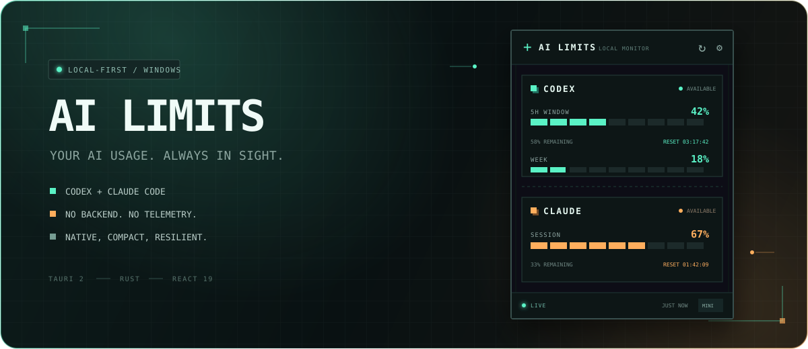
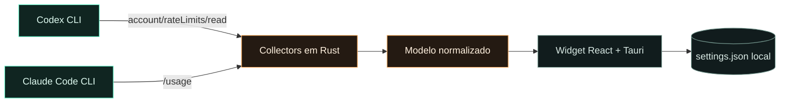

<div align="center">
  
</div>

<h1 align="center">AI Limits</h1>

<p align="center">
  <strong>Seus limites de IA, sempre à vista.</strong><br />
  Um widget Windows compacto, local-first e sem telemetria para acompanhar<br />
  as janelas de uso do Codex e do Claude Code em tempo real.
</p>

<p align="center">
  
  
  
  
  
</p>

---

## O que é

AI Limits elimina a pergunta _“quanto ainda posso usar?”_ antes que ela interrompa seu fluxo. Ele consulta os clientes oficiais já autenticados na sua máquina e transforma os limites retornados em um painel discreto, sempre acessível e fácil de ler.

> **Uso real, direto da fonte.** O app não calcula custos, não conta tokens e não inventa estimativas.

### Feito para desaparecer no seu fluxo

- **Três densidades:** `NORMAL`, `MINI` e `COLLAPSED`.
- **Always on top:** fica visível sem disputar espaço com seu editor.
- **Atualização automática:** refresh configurável entre 30 e 300 segundos.
- **Countdown de reset:** nova coleta automática quando uma janela reinicia.
- **Resiliência por provider:** uma falha no Codex não derruba o Claude — e vice-versa.
- **Último valor conhecido:** dados válidos continuam visíveis com indicação `STALE`.
- **Tray e atalho global:** `Ctrl + Alt + L` mostra ou esconde o widget.
- **Memória de layout:** posição, tamanho, opacidade e modo são persistidos localmente.

## Como funciona



O backend Rust executa os CLIs oficiais em processos ocultos, aplica timeout, normaliza as janelas de uso e envia apenas os dados necessários para a interface Tauri. Nenhum servidor intermediário participa do caminho.

## Começando

### Pré-requisitos

- Windows 10/11 com WebView2;
- Node.js 20+ e npm;
- Rust stable com toolchain MSVC e Windows SDK;
- Codex CLI e/ou Claude Code instalados e autenticados.

### Desenvolvimento

```powershell
git clone https://github.com/IsaacRop/LLM-Usage.git
cd LLM-Usage
npm install
npm run tauri dev
```

O app aceita apenas um provider disponível; o outro será mostrado como `Unavailable` sem impedir o funcionamento.

### Build standalone

```powershell
npm run tauri -- build --no-bundle
```

O executável será gerado em:

```text
src-tauri/target/release/llm-usage-monitor.exe
```

O instalador está desativado no momento para manter o build mínimo. O `.exe` resultante é standalone.

## Fontes dos dados

| Provider | O que é lido | Fonte | Fallback |
| :-- | :-- | :-- | :-- |
| **Codex** | Percentual usado, duração e horário de reset das janelas primária e secundária | `codex app-server --stdio` → `account/rateLimits/read` | `Unavailable` ou último valor válido como `STALE` |
| **Claude Code** | Sessão atual, semana atual e respectivos resets | `claude -p "/usage" --output-format json` | `Unavailable` ou último valor válido como `STALE` |

No Codex, `remainingPercent` é somente `100 - usedPercent`. No Claude, o mesmo cálculo usa o percentual devolvido pelo próprio `/usage`. O reset textual do Claude é convertido para um timestamp local apenas para alimentar o countdown.

## Privacidade por design

```text
✓ reutiliza sessões locais já autenticadas
✓ não lê auth.json ou .credentials.json
✓ não copia nem persiste tokens
✓ não envia telemetria
✓ não usa backend ou serviço na nuvem
✓ salva apenas preferências do widget
```

As preferências ficam em `settings.json`, no diretório de configuração da aplicação. A opção **Launch on Windows** usa exclusivamente a chave de usuário `HKCU\Software\Microsoft\Windows\CurrentVersion\Run`.

## Controles

| Ação | Onde |
| :-- | :-- |
| Mostrar ou esconder | `Ctrl + Alt + L` |
| Mover o widget | Arraste a barra superior |
| Alternar `NORMAL` / `MINI` | Duplo clique na barra ou botão de modo |
| Atualizar agora | Botão `↻` ou menu do tray |
| Restaurar, mudar modo ou sair | Menu do tray |
| Ajustar tamanho, opacidade e intervalo | Painel `CONTROL PANEL` |

## Stack

| Camada | Tecnologia |
| :-- | :-- |
| Desktop shell | [Tauri 2](https://tauri.app/) |
| Interface | [React 19](https://react.dev/) + TypeScript |
| Backend local | Rust |
| Tooling | Vite 8 |
| Integrações | Codex app-server + Claude Code CLI |

## Validação

```powershell
# TypeScript + bundle web
npm run build

# Testes unitários do backend
cargo test --manifest-path src-tauri/Cargo.toml

# Smoke test real — requer ambos os CLIs autenticados
cargo test --manifest-path src-tauri/Cargo.toml -- --ignored live_collectors_smoke_test
```

## Limitações conhecidas

- `account/rateLimits/read` é uma interface experimental do app-server do Codex e pode mudar entre versões do CLI.
- O `/usage` do Claude chega em um envelope JSON, mas seu conteúdo útil ainda é textual; mudanças nos rótulos podem exigir atualização do parser.
- A aplicação é focada em Windows e não tenta substituir os mecanismos oficiais por scraping de sites.

## Contribuindo

Issues e pull requests são bem-vindos. Para mudanças em collectors, inclua testes que comprovem que percentuais não são inferidos ou fabricados. Para mudanças visuais, preserve a legibilidade nos três modos de exibição.

---

<p align="center">
  <sub>Construído para quem usa IA intensamente — sem transformar produtividade em mais uma aba aberta.</sub>
</p>
